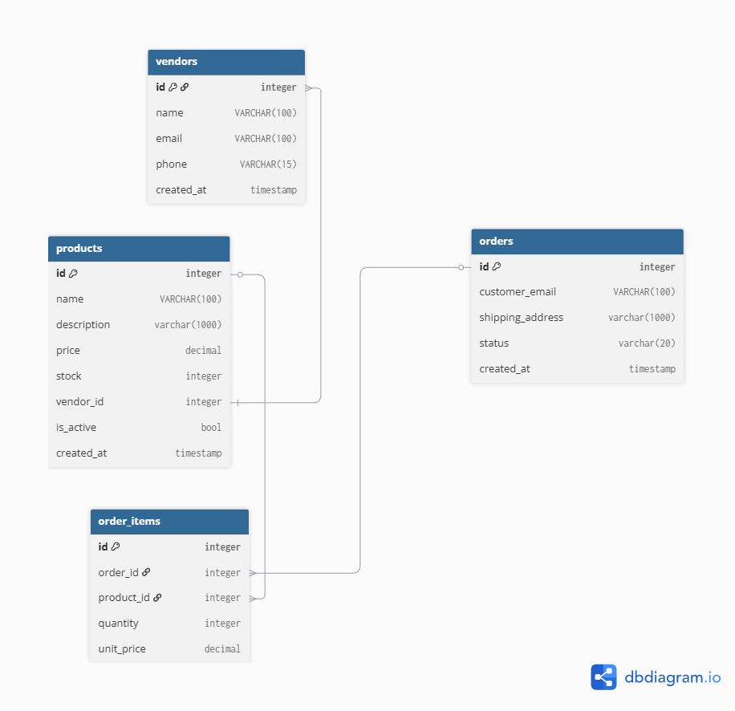
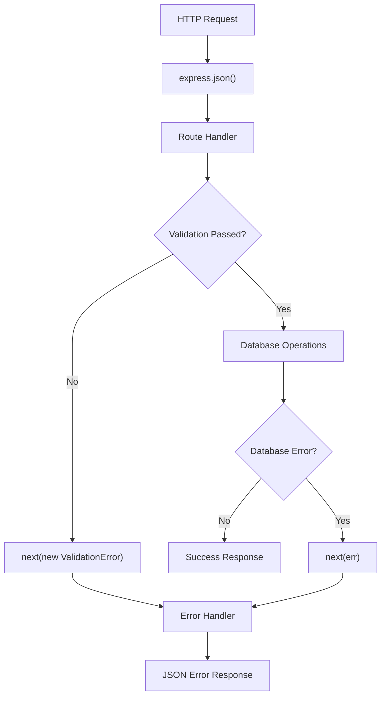

# Multi-Vendor Marketplace REST API

A Node.js/Express REST API for a multi-vendor marketplace: vendors list products, customers place orders, and each order can contain products from one or more vendors.

<video autoplay muted loop playsinline>
  <source src="docs/marketplace_api.mp4" type="video/mp4">
  Your browser does not support the video tag.
</video>

## About

This API models a small marketplace with four related tables (`vendors`, `products`, `orders`, `order_items`). It is a learning-focused backend: CRUD for each resource, parameterized SQL, request validation, centralized error handling, and transactions where a single action must write more than one row.

The [build log](BUILD-LOG.md) records the design decisions behind the schema, routes, and deployment.

## Built With

- Runtime: Node.js
- Framework: Express 5
- Database: MySQL (`mysql2/promise`)
- Configuration: dotenv
- Development server: nodemon
- Manual testing: [Postman collection](docs/postman_collection.json)

## Getting Started

### Prerequisites

- Node.js 24+
- npm 11+
- MySQL 8+

### Installation

```bash
git clone https://github.com/srzen/marketplace-api
cd marketplace-api
npm install
```

Create a MySQL database and load the schema:

```bash
mysql -u your_database_user -p your_database_name < schema.sql
```

Copy [`.env.example`](.env.example) to `.env` and fill in your values:

```
PORT=3000
DB_HOST=localhost
DB_USER=your_database_user
DB_PASSWORD=your_database_password
DB_NAME=your_database_name
```

Optionally seed sample data (3 vendors, 12 products, 3 orders). The script asks for confirmation before clearing existing rows:

```bash
npm run seed
```

Start the development server:

```bash
npm run dev
```

Confirm the process with `GET /api/health`. It should return `{ "status": "ok" }`.

### Testing with Postman

Import [`docs/postman_collection.json`](docs/postman_collection.json) into Postman. The collection is named **Multi-Vendor Marketplace REST API Tests** and covers vendors, products, and orders against `http://localhost:3000`.

Manual regression results (status codes for success, validation, missing resources, and order conflicts) are recorded in [`docs/test-results.md`](docs/test-results.md).

## API Overview

All resource routes are prefixed with `/api`.

| Method | Path                | Notes                                                                     |
| ------ | ------------------- | ------------------------------------------------------------------------- |
| GET    | `/api/health`       | Liveness check; does not query the database                               |
| GET    | `/api/vendors`      | List vendors                                                              |
| GET    | `/api/vendors/:id`  | Single vendor                                                             |
| POST   | `/api/vendors`      | Create (`201`)                                                            |
| PATCH  | `/api/vendors/:id`  | Partial update                                                            |
| DELETE | `/api/vendors/:id`  | Delete                                                                    |
| GET    | `/api/products`     | List; optional `vendor_id` and `max_price` query filters                  |
| GET    | `/api/products/:id` | Single product                                                            |
| POST   | `/api/products`     | Create (`201`)                                                            |
| PATCH  | `/api/products/:id` | Partial update                                                            |
| DELETE | `/api/products/:id` | Delete                                                                    |
| GET    | `/api/orders`       | List orders (no line items)                                               |
| GET    | `/api/orders/:id`   | Order plus nested items, product names, and vendor names                  |
| POST   | `/api/orders`       | Create order and line items in one transaction (`201`)                    |
| PATCH  | `/api/orders/:id`   | Partial update; `409` if the order is no longer `Pending` or `Processing` |
| DELETE | `/api/orders/:id`   | Delete; line items are removed by `ON DELETE CASCADE`                     |

Unknown paths return `404` with `{ "error": "Route not found" }`. Expected failures use custom error classes (`ValidationError`, `NotFoundError`, `ConflictError`) and a shared JSON `{ "error": "..." }` body.

## Project Structure

```
marketplace-api/
├── docs/                      # Concept notes, schema diagram, Postman collection
├── src/
│   ├── db/                    # MySQL connection pool
│   ├── errors/                # NotFoundError, ValidationError, ConflictError
│   ├── middleware/            # Centralized error handler
│   ├── routes/                # vendors, products, orders
│   ├── utils/                 # Shared input validation
│   └── index.js               # App setup, routes, startup
├── .env.example
├── schema.sql
├── seed.js
├── BUILD-LOG.md
└── README.md
```

## Database Schema

The executable schema is [`schema.sql`](schema.sql). Design notes, foreign keys, and delete rules are in [`docs/concept-schema-design.md`](docs/concept-schema-design.md).

- Products belong to one vendor (`ON DELETE RESTRICT`).
- `order_items` is the join between orders and products (many-to-many).
- Deleting an order cascades to its line items; a product that appears on an order cannot be deleted while that history remains.
- `order_items.unit_price` stores the price paid at purchase time, not the product's current listing price.



## Request Processing Flow

Requests are parsed as JSON, handled by a route, then either answered or forwarded with `next(err)` to the error middleware. See [`docs/concept-middleware-chain-design.md`](docs/concept-middleware-chain-design.md) for the full chain, including unmatched-route `404`s.



## Concept Notes

Shorter write-ups of individual ideas used in this project:

- [Relational schema design](docs/concept-schema-design.md) - tables, keys, and delete behavior
- [HTTP status codes](docs/concept-http-status-codes.md) - `200`, `201`, `400`, `404`
- [SQL joins](docs/concept-sql-joins.md) - order detail query across four tables
- [Database transactions](docs/concept-db-transactions.md) - seed script and `POST /orders`
- [Filterable queries](docs/concept-filterable-query.md) - `vendor_id` and `max_price` on products
- [Route validation](docs/concept-route-validation.md) - manual checks before a schema library
- [Error handling](docs/concept-error-handling.md) - centralized middleware and custom errors
- [Middleware chain](docs/concept-middleware-chain-design.md) - registration order and `next(err)`
- [Server deployment](docs/concept-server-deployment.md) - Linux VPS, NVM, MySQL, firewall
- [Persistent service](docs/concept-persistent-service.md) - PM2 and systemd

## Key Features

- Full CRUD for vendors, products, and orders, with parameterized SQL to keep user input out of query strings
- Product listing filters (`vendor_id`, `max_price`) built as a dynamic `WHERE` clause with matching `?` values
- Order creation in a single transaction: parent order, trusted product prices from the database, then line items (rollback on failure)
- Nested order-detail responses: one JOIN query, then mapped into `{ order, items[] }` JSON
- Centralized errors (`400` / `404` / `409` / `500`) so clients always get `{ "error": "..." }`
- Transactional seed script that respects foreign-key insert/delete order and asks before wiping data

## What I Learned

- HTTP status codes should describe the outcome (`201` for create, `404` vs `400` vs `409`), not just “the server answered.”
- Foreign keys and `ON DELETE` rules are schema decisions: cascade line items with an order, but do not drop vendors or products that still have dependents.
- Transactions keep multi-step writes (seed, order + items) atomic; rollback code has to handle failures that happen before a connection is even acquired.
- SQL returns flat JOIN rows; the API layer is responsible for turning those into nested JSON.
- Express middleware is a pipeline: load env once at the entry point, validate before hitting the database, and send every expected failure through the same error handler so the response shape stays consistent.

## License

This project is licensed under the MIT License. See [LICENSE](LICENSE).
