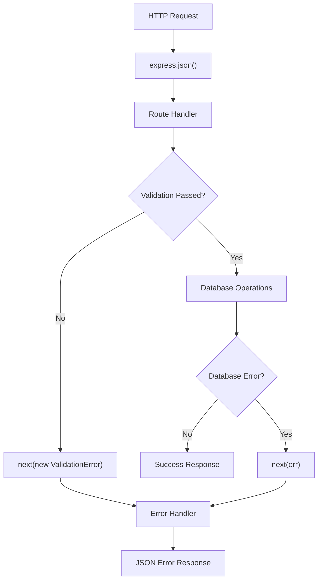
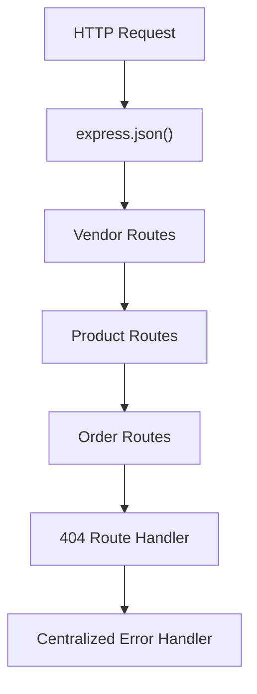
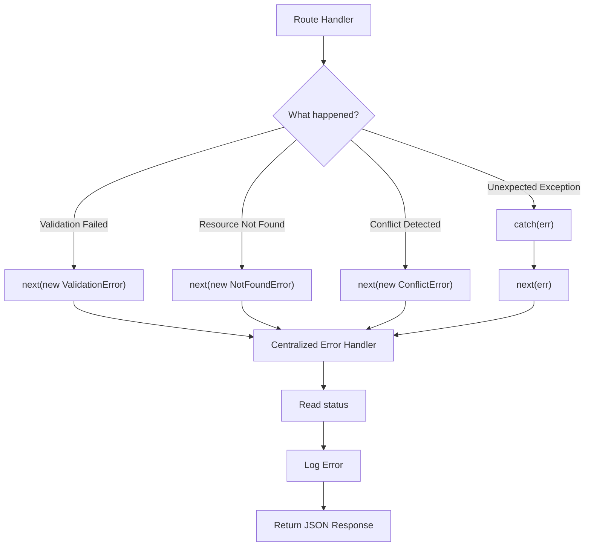

# Middleware Chain Design

This API follows Express's middleware pipeline, where each request passes through middleware in the order it is registered. Each middleware is responsible for a single concern and either,

- Handles the request and sends a response.
- Passes control to the next middleware using `next()`.
- Forwards an error using `next(err)`.

This design separates routing, validation, business logic, and error handling into predictable stages.

## Request Processing Flow

## Middleware Order

## Error Handling Flow

## Design Decisions

### Centralized Error Handling

Unexpected errors are forwarded to a single error-handling middleware using `next(err)`. This middleware is responsible for logging errors and returning consistent JSON responses while preventing internal stack traces from being exposed to clients.

### Custom Error Classes

Expected API errors are represented using custom error classes (`NotFoundError` and `ValidationError`). Each class extends JavaScript's built-in `Error` object and provides an HTTP `status`, allowing the error handler to generate the correct response without additional conditional logic.

### Manual Request Validation

Input validation is performed inside each POST and PATCH route before any database operations occur. Validation ensures that required fields exist, values are of the expected type, and only permitted fields are accepted. A small helper function is reused to validate individual input values while keeping endpoint-specific validation rules within their respective routes.

### Future Improvements

For larger applications, validation logic can be extracted into reusable middleware and implemented using schema validation libraries such as **Joi** or **Zod**. This project intentionally uses manual validation to understand the underlying concepts before adopting external libraries.
