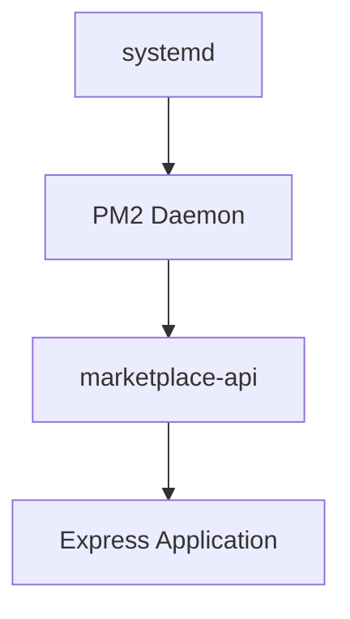

# Persistent Background Service Using PM2

## Objective

Configure the Express.js application to run as a persistent background service using PM2 so that it remains available independently of SSH sessions and automatically restarts after crashes or server reboots.

## Architecture

## Deployment Process

1.  Installed PM2 globally using npm.
2.  Started the application under PM2 with a named process.
3.  Verified the process status using pm2 list.
4.  Inspected runtime output using pm2 logs.
5.  Configured PM2 to start automatically during system boot.
6.  Saved the current process list so PM2 can restore the application after reboot.
