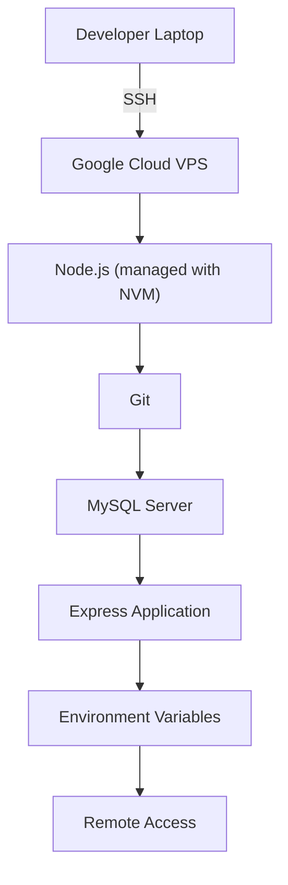

# Remote Server Environment Setup

## Objective

Deploy the Express.js application to a remote Linux VPS by configuring the server environment, installing the required runtime, preparing the database, and securely configuring environment variables.

## Architecture

## Deployment Process

1.  Provisioned a Debian Linux virtual machine on Google Cloud.
2.  Connected to the server using SSH.
3.  Installed NVM and configured the same Node.js version used during development.
4.  Verified Node.js and npm versions matched the local development environment.
5.  Installed Git and cloned the application repository from GitHub.
6.  Installed project dependencies using `npm install`.
7.  Installed and configured MySQL on the server.
8.  Created the application database with a dedicated MySQL user.
9.  Imported the project schema and seed data.
10. Created environment variables on the server instead of copying the local `.env` file.
11. Started the application and verified successful database connectivity.
12. Configured the Google Cloud firewall to allow inbound TCP traffic on port 3000 for testing.
13. Verified the API actions remotely using the server's public IP address.
